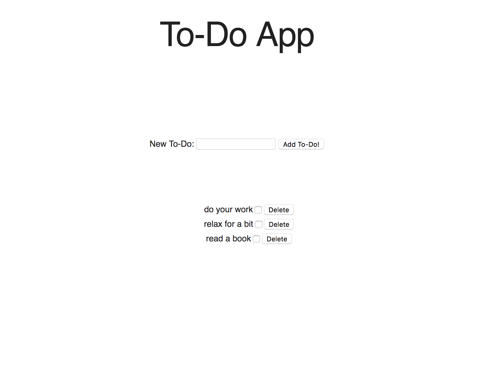

# to-do-app

As an assignment for the Bloc Apprenticeship, I built out a quick interface for a To Do App.

The objectives here were to:
1. Understand DOM elements and how they enable interactivity
2. Create Event Listeners and methods
3. Recognize and use common ES6 features
4. Understand concepts of state and UI
5. Organize code in a more readable manner

I was tasked with adding components like a delete button, with the functionality to delete to-dos in the list. 
MDL was used to structure the appearance of the app.

Please see image of the app, below:

